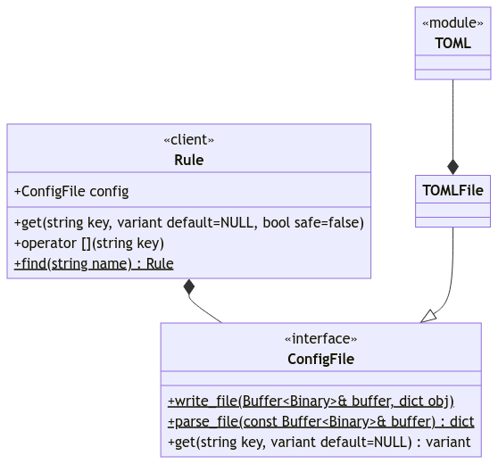

#+title: JBackup
#+subtitle: Simple Backup System
#+latex_class: report
#+author: John Russell
#+startup: content

#+macro: exusage Example usage:

#+begin_abstract
JBackup is a command-line application for backing up files and directories. A set of config files called /rules/ set the parameters for each backup.
#+end_abstract

* Synopsis

JBackup is a command-line application for devlopers who want a quick and easy way to compress their local repositories into a standard directory.

** Terminology

- Rule :: A configuration file that provides arguments to an action.

** User Interface

JBackup is a command-line application (/CLI/).

*Global Options:*

| ~-v~ | ~--verbose~ | Show what is happening. |

*** Compress

A command that compresses a directory, usually a repository. It works by loading a configuration file called a [[*Terminology][rule]] to get parameters for the command.

#+begin_example
  jbackup compress RULE...
#+end_example

{{{exusage}}}

#+begin_src sh
  $ jbackup compress my-repo
  # /home/user/jbackup/.git/
  # /home/user/jbackup/.git/config
  # /home/user/jbackup/.git/hooks/
  # ...
  # /home/user/jbackup/.git/objects/a5/1c3bbe3d18247525b0516a052da3f8484e3ea3
  # /home/user/jbackup/.git/objects/a5/7387c9f2383db05a7f2ec84946c5796faa1b9a
#+end_src

*** New

Creates a new rule named /RULE/ with default values.

#+begin_example
  jbackup new RULE
#+end_example

{{{exusage}}}

#+begin_src sh
  $ jbackup new my-repo
  # Created '/home/user/.local/share/jbackup/rules/my-repo.toml'
#+end_src

*** Config

Set or query configuration values. You can also edit the configuration file directly.

#+begin_example
  jbackup config [OPTIONS] CONFIG [VALUE]
#+end_example

*Options:*

| ~-e~ | ~--edit~ | Edit the configuration file in $EDITOR. |

{{{exusage}}}

#+begin_src sh
  $ jbackup config compress.verbose
  # false
  $ jbackup config compress.verbose true
  $ jbackup config compress.verbose
  # true
#+end_src

*** Locate

Print the location of a rule.

#+begin_example
  jbackup locate RULE
#+end_example

{{{exusage}}}

#+begin_src sh
  jbackup locate my-repo
  # /home/user/.local/share/jbackup/rules/my-repo.toml

  jbackup locate jbackup
  # /home/user/.local/share/jbackup/rules/jbackup.toml
#+end_src

* Technical Specification

As an overview, JBackup is written in Python. We will be using ~typer~ to parse command-line arguments. Rules will be implemented using the /adapter pattern/.

More to the topic of of /command-line arguments/ (CLA), each command is its own function. All commands are on the same page.

** Rules

A rule is a configuration file that provides the parameters to any given command. It's implemented using the adapter pattern.

#+attr_latex: :width 9cm

# [](http://localhost:5005/edit#pako:eNqVUk1v2zAM_SsCEQx1Jwf-iO3GaHNoi57SDdjHZfMwKDaVqbWlQJbbZVn626fIcecAu0wX0-R7j3wEd1CqCiGHsmZteyvYWrOmkMQ-lyEfuhrJrs8c3uVlWQuUZrH4m3t7oyQX6zthoaULR7U1mrPWaCHX5BG3lDwxLZg0pELOutpcvfu8XFKyUqomLeN4xVndojcSUBvUzChNvn4bCY0RXMhqKEnWoNdPPekh-7Gd0aQnpoQ0qDkr8cTXsxYGv3OLPrvuOEf9ci0k09uXN2Tl_impRGmIWj14kxFvw3R75Nl9tIb8m-317Ml_bssbsq_--sCZPvf9kcmh1Jv_9P5-eWq7UZUlDZ5flRzQ989d0OsMabc63_-9OOkCFBrUDROVPSXXoQDzAxssILfhcfoCCrm3UNYZ9XErS8iN7pBCt6mYwePxQe4ugMKGSch38BPyOAumcZAms3mQRVGapBS2kIdhNA3COE7TdD6Pwoss2VP4pZRVCKZpdJFmQZTMwjALkyCmgJWwR3R_vPbDx7X44giHOfZ_ALJu7wg)

The client ~Rule~ holds an instance of ~ConfigFile~, which is an interface to the ~TOMLFile~ adapter, which uses the ~TOML~ library. As one can guess, rules are currently written in TOML.

#+caption: An example rule file
#+name: fig:rule-ex
#+begin_src toml
  [compress]
  verbose = false
  archive = "/var/backups/user/my-repo.tar.gz"
  source = "~/my-repo"
  extraOptions = { compressionProgram = "" }
#+end_src

As shown in Listing [[fig:rule-ex]], parameters for the ~compress~ command are under the "compress" section. There are options for setting the path to the archive, the path to the repository, and extra options specific to the format used.
